# Paytm-clone #
[project-live](https://paytmcloneweb.netlify.app)
   - - - -
 # Technology used in this project #
  
   
   

   - - - - 
* Skill Gained in this project
  * In this project i learned to make website responsive for multiple screen using __Tailwind__
  * Learned to add __animation in buttons__
   Learned to define color in top of tailwind file and call when we nedded we defines colors using __primary, danger,  warning sucess etc__
  * Learned to create __multiple navbar for multiple screens__
  * Learned to create __footer section of for multiple screens__
  * Learned to  change direction of content in row or column  and align item  using __flex:col__, __justifycontent__
  ,__align item__
 
  * Learned to define screens in top and called when we need we defines screens using __sm, md, lg, xl__

  
  
 ## Time taken to complete this project ##
 *  20 to 22 hrs completed this poject
 
 ## Destop view ##
 
 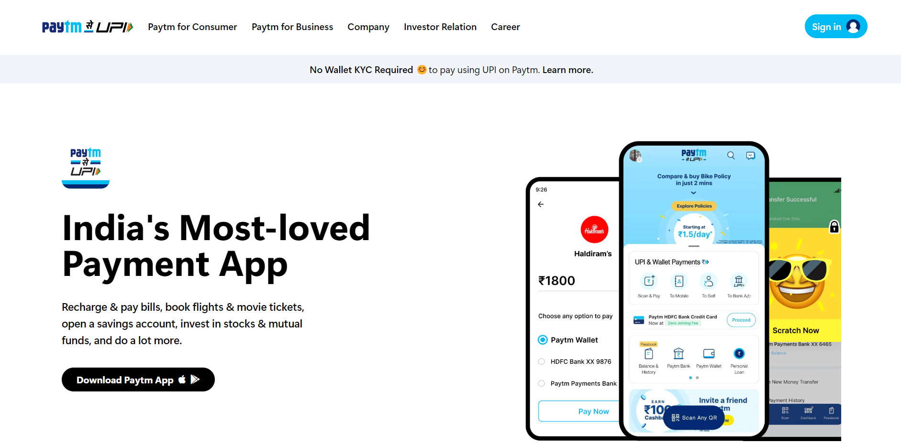 
 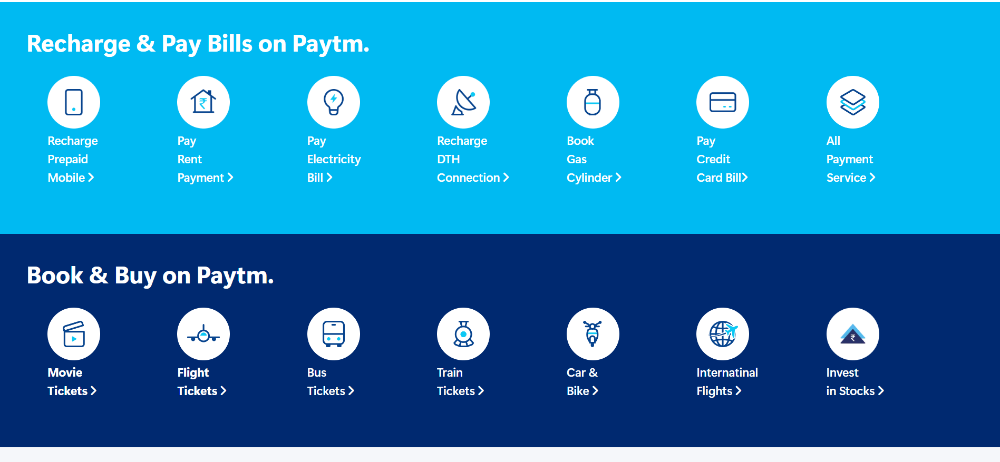
 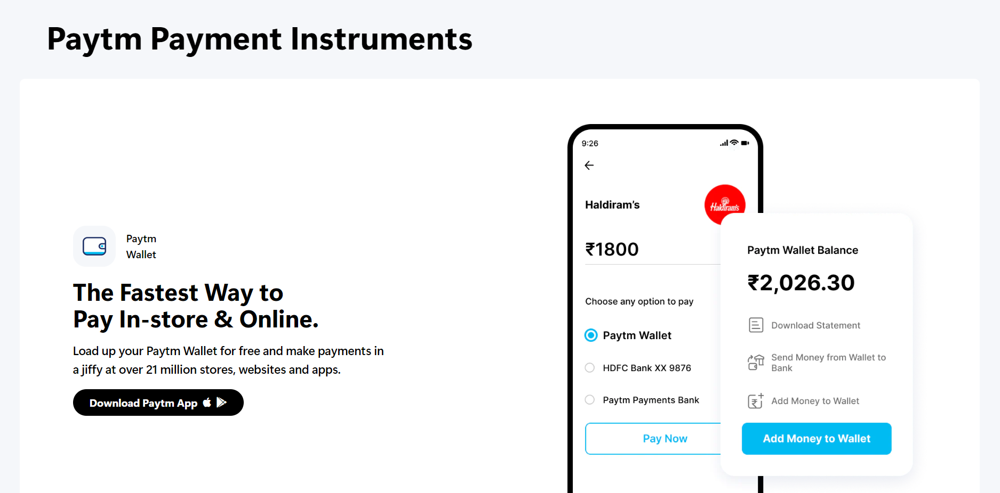
 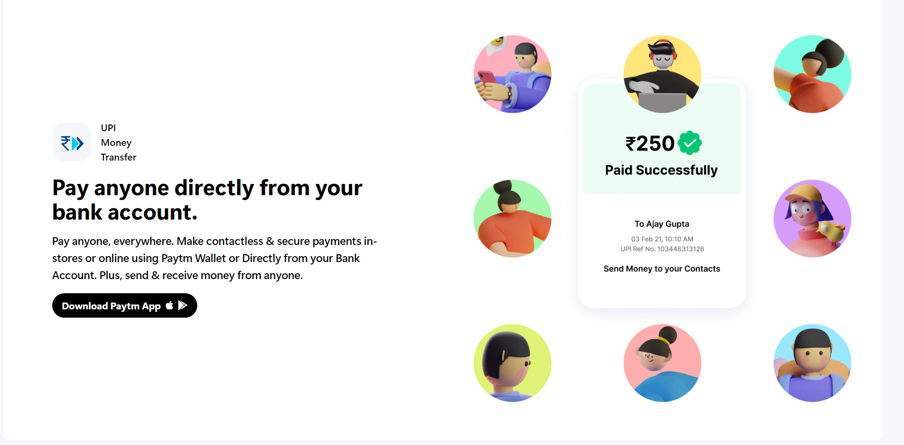
 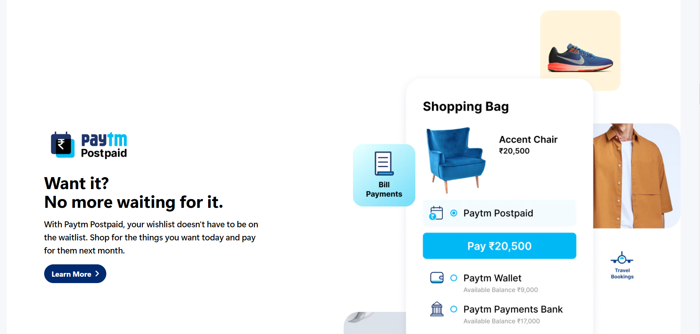
 
 
 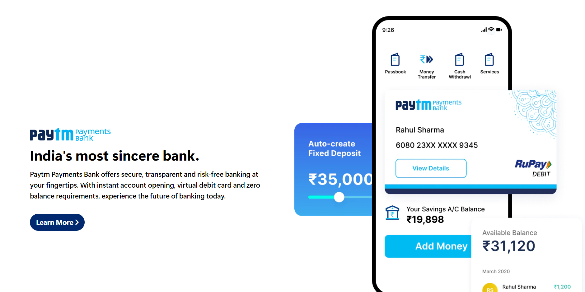
 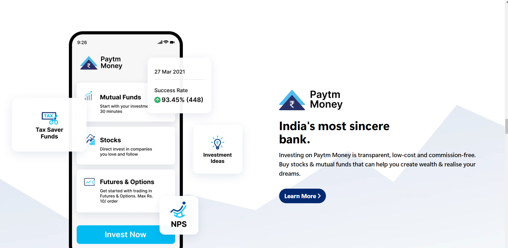
 
 
 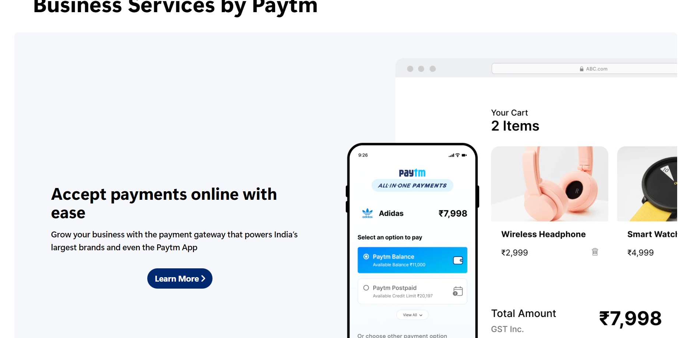
 
 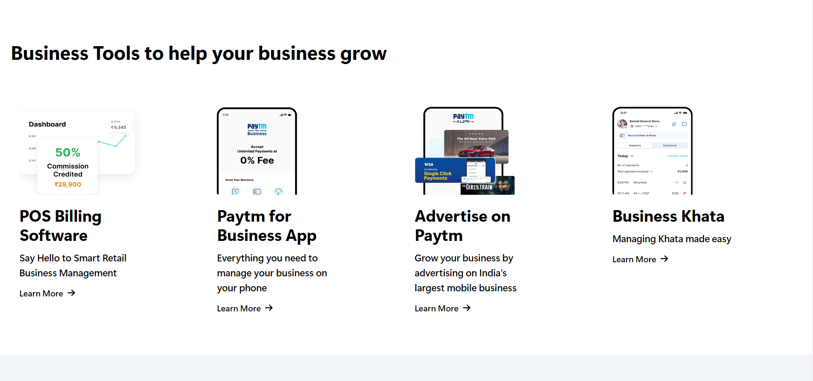
 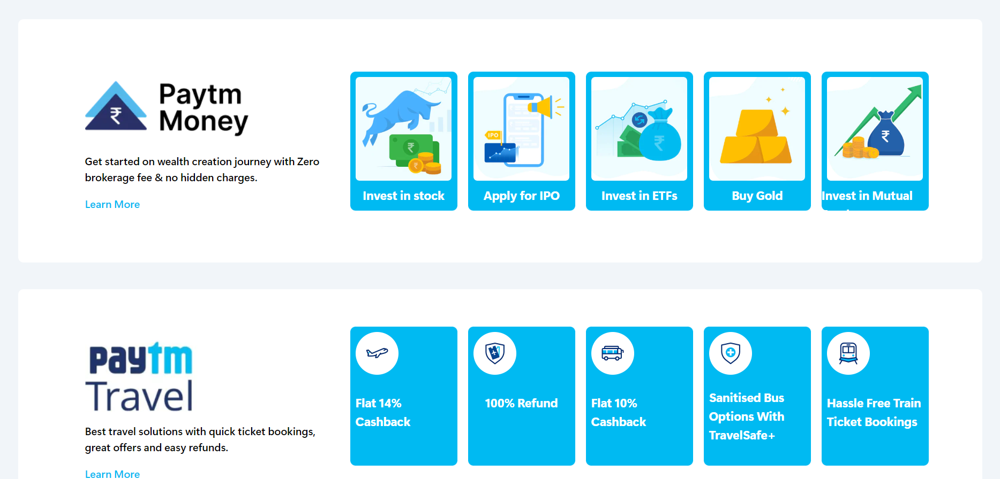
 

 ## Moblie View
  
  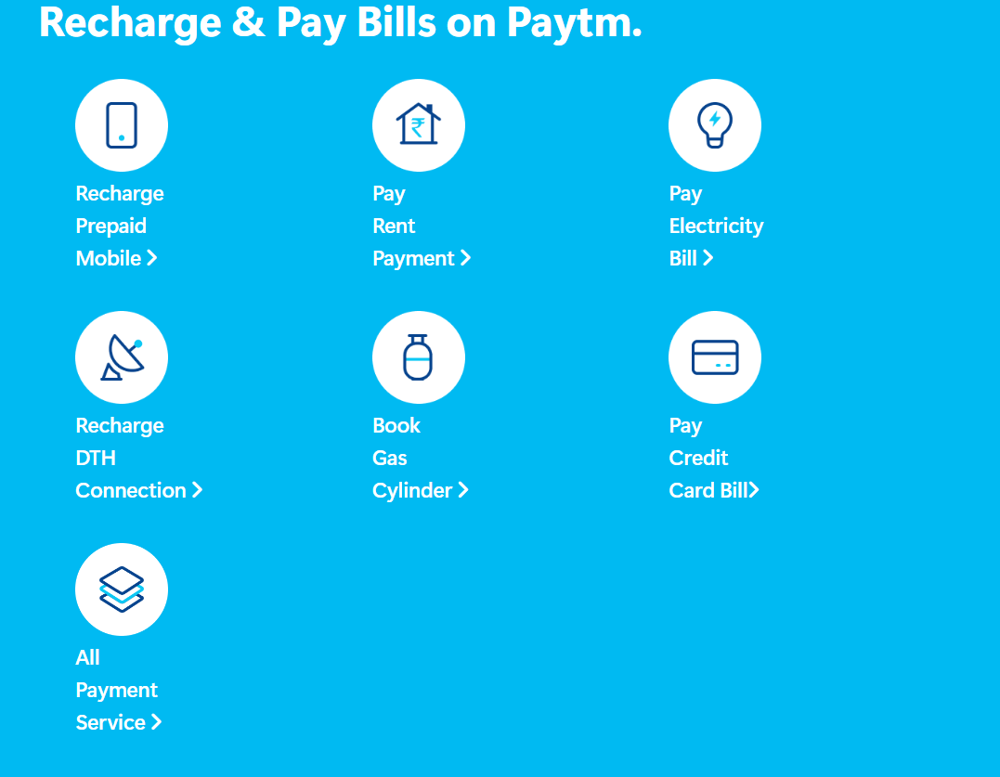
  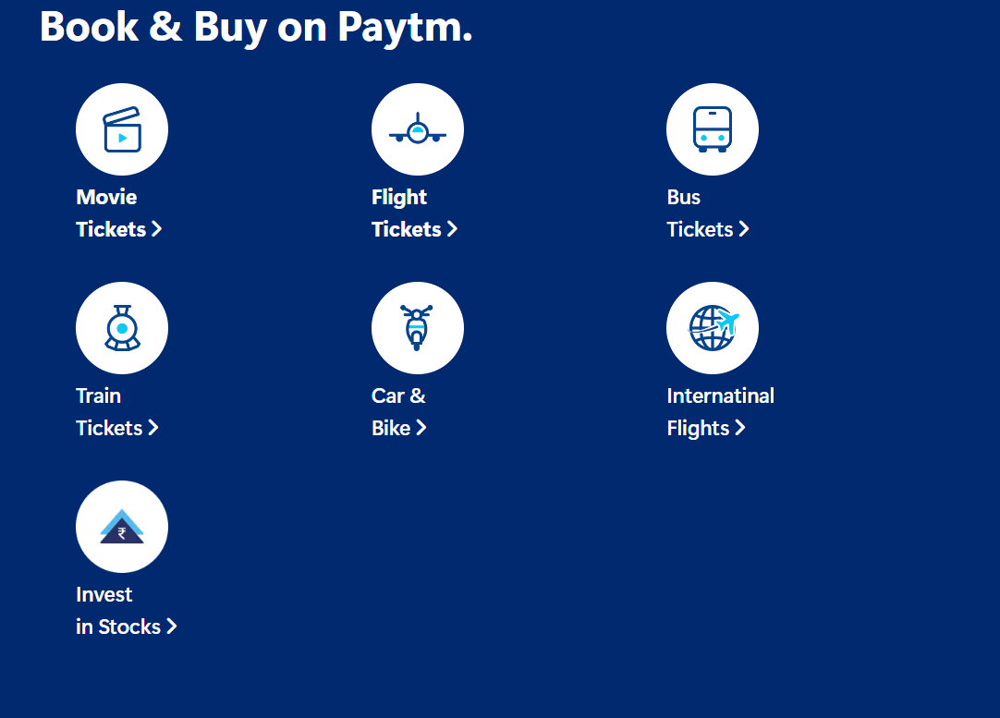
   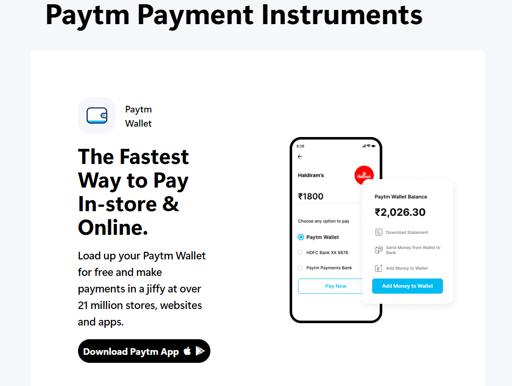
   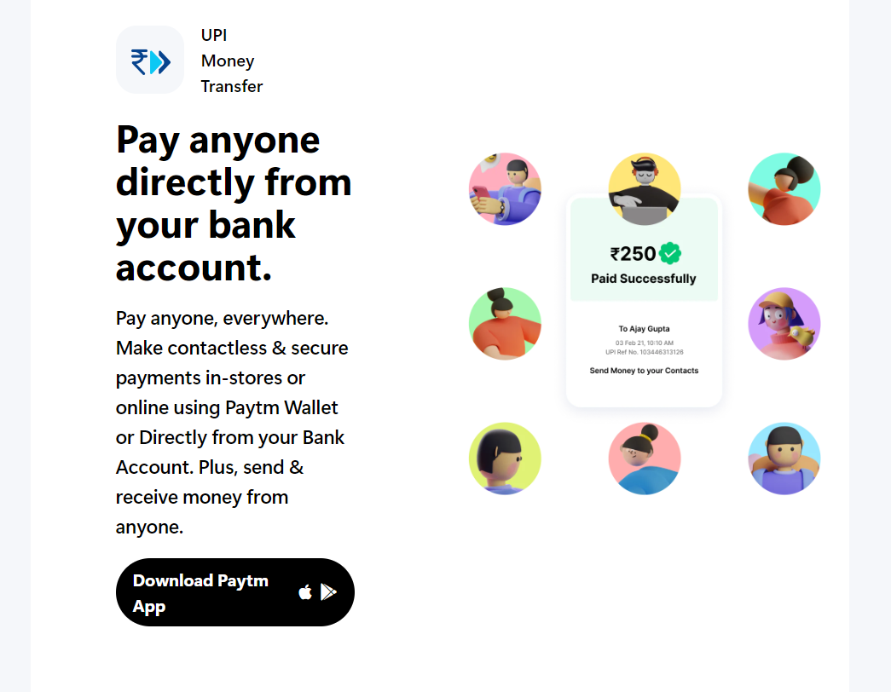
   
   
   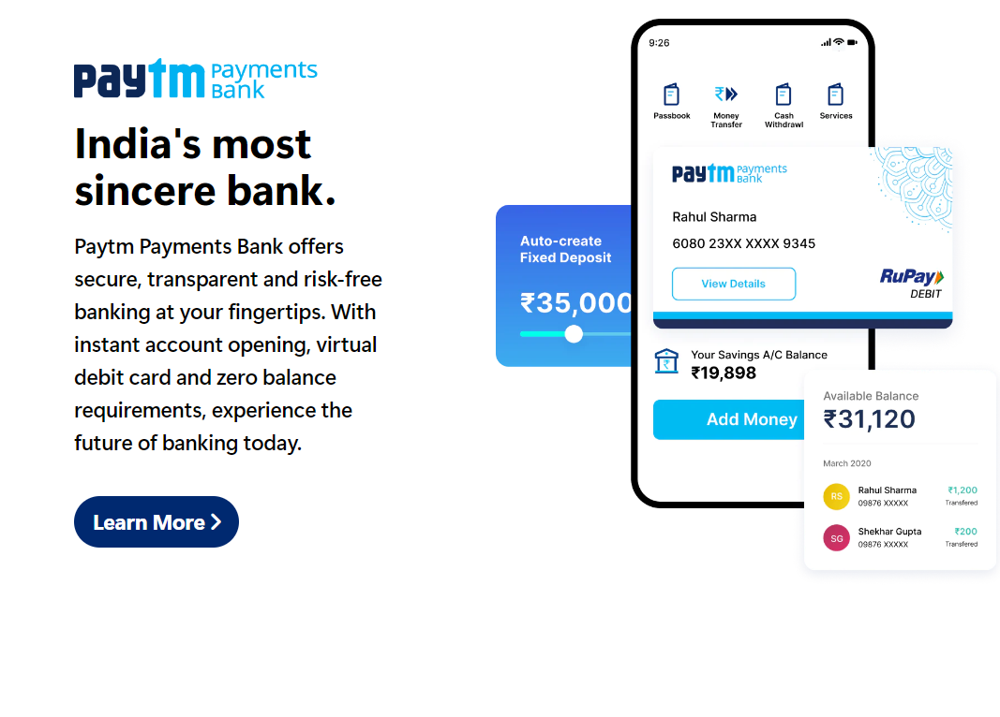
   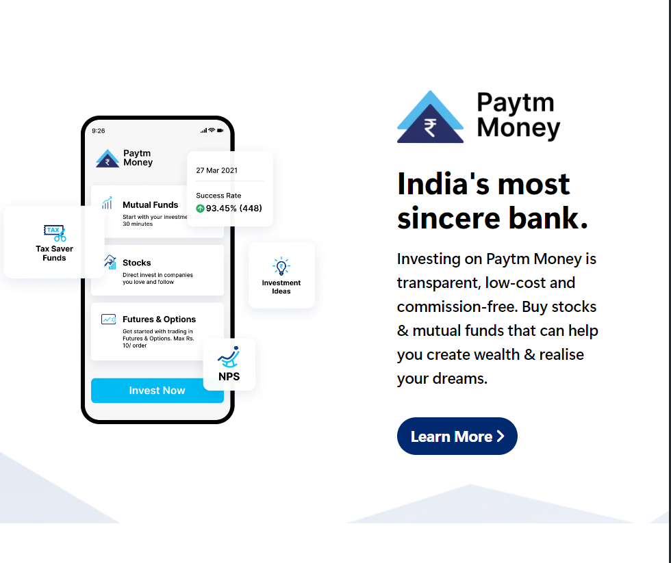
   
 
 
   
   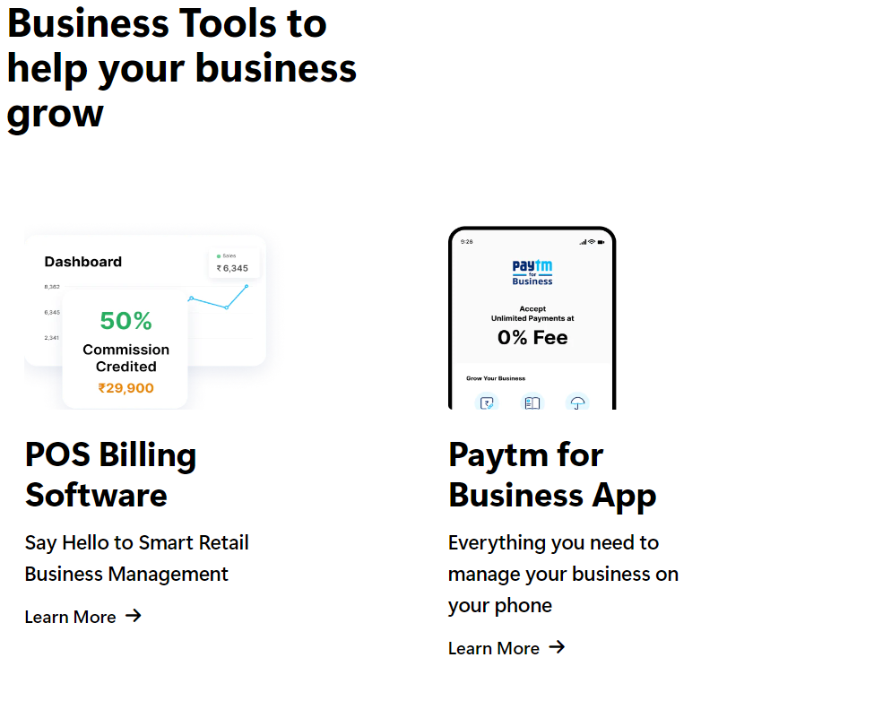
   
   
   